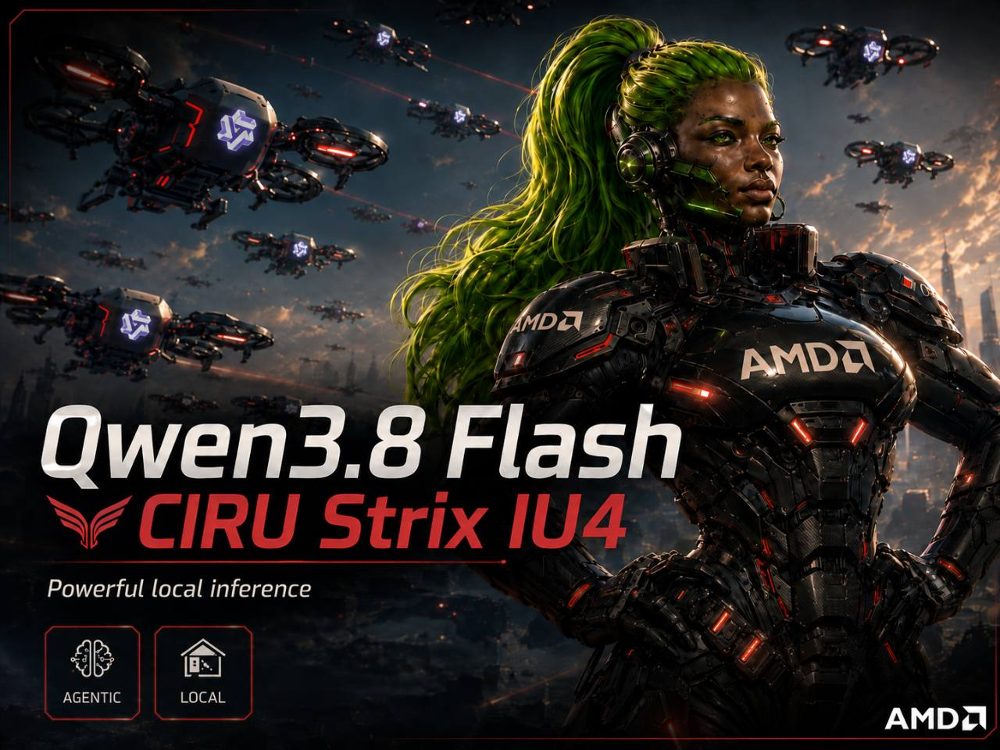

# Qwen3.8-Flash-CIRU-STRIX-IU4

[](https://llm.ciru.ai/research)

**A quality-first, long-context Qwen3.8-Flash-Next build for fast local inference on AMD Strix Halo.**

This repository is the required CIRU `llama.cpp` runtime. The model files are hosted at [jcbtc/Qwen3.8-Flash-CIRU-STRIX-IU4](https://huggingface.co/jcbtc/Qwen3.8-Flash-CIRU-STRIX-IU4).

> [!IMPORTANT]
> This is not a stock-GGUF release. The main GGUF requires this runtime and the external CIRUPLE1 PLE directory. The optional MTP GGUF enables the headline speculative-decoding profile. A stock `llama.cpp` binary will not load the complete release correctly.

## Headline results

| Result | Score | Scope |
|---|---:|---|
| HumanEval | **160/164 (97.56%)** | Full 164-task local-custom chat run |
| HumanEval+ | **155/164 (94.51%)** | Full 164-task EvalPlus run |
| ARC-Challenge | **1,143/1,172 (97.53%)** | Full EvalScope dataset |
| ToolEval Standard | **115/138 points (83.33%)** | 69 local-custom cases |
| ToolEval Hard | **23/30 points (76.67%)** | 15 local-custom hard cases |
| 8K cold prefill | **359.43 tok/s** | H121, 8,192-token prompt |
| 8K generation | **30.80 tok/s** | H121, 128 generated tokens, MTP depth 3 |
| Long-context coverage | **131,072 prompt tokens** | Cold, exact-count context ladder |

Quality results use the same released model artifacts on the earlier H96 depth-1 runtime. H121 is a runtime-only allocator-lifetime correction; the quality suites have not yet been rerun on H121 depth 3. Scores marked local-custom are not claimed as canonical leaderboard submissions. See [benchmarks and methodology](docs/BENCHMARKS.md).

## What is special about this build?

- Quality-first mixed storage: 144 routed-expert tensors use Q4_1, while protected tensors remain Q5_K, Q5_1, Q8_0, BF16, or F32.
- Native IU4 WMMA execution for the stored Q4_1 expert weights on gfx1151. `IU4` names the optimized execution path, not a uniform four-bit model or a custom on-disk GGUF type.
- Exact FP8 E4M3 PLE weights are paged from NVMe through the required CIRUPLE1 sidecar, with a 4 GiB decoded-page cache.
- Q8_0 MTP speculative decoding, configured at depth 3 for the public performance profile.
- A production prompt/prefill cache profile: prompt cache enabled, 8 GiB RAM cache, idle-slot caching, and context checkpoints enabled.
- Native 262,144-token context configuration; measured cold-prompt coverage through 131,072 tokens.

## Required files

Download the complete package:

```bash
python -m pip install -U "huggingface_hub[cli]"
hf download jcbtc/Qwen3.8-Flash-CIRU-STRIX-IU4 \
  --local-dir ./model
```

The production profile expects:

```text
model/
├── Qwen3.8-Flash-CIRU-STRIX-IU4.gguf
├── mtp/
│   └── Qwen3.8-Flash-CIRU-STRIX-IU4-MTP-Q8_0.gguf
└── ple/
    ├── ple.manifest.json
    ├── ple.payload.bin
    └── ple.scale.bf16
```

The target GGUF and every file under `ple/` are mandatory. The MTP file is optional only if you accept lower generation performance and remove the `--spec-*` flags.

## Build

The validated fast path is Linux x86-64, AMD ROCm, and `gfx1151` on a Ryzen AI Max+ 395 / Radeon 8060S:

```bash
git clone --branch v1.0.0-h121 \
  https://github.com/ciru-ai/Qwen3.8-Flash-CIRU-STRIX-IU4.git
cd Qwen3.8-Flash-CIRU-STRIX-IU4
ROCM_ROOT=/opt/rocm ./scripts/ciru/build-linux-amd.sh
```

Other operating systems and distro-specific dependencies are covered here:

- [Linux and WSL2](docs/BUILD_LINUX.md)
- [Windows](docs/BUILD_WINDOWS.md)
- [macOS](docs/BUILD_MACOS.md)

Windows CPU and macOS Metal are compatibility builds, not validated Strix performance paths. On WSL2, keep the PLE directory on the Linux ext4 filesystem rather than `/mnt/c` because the optimized pager uses `O_DIRECT`.

## Run with public production settings

```bash
MODEL_DIR="$PWD/../model" ./scripts/ciru/run-server.sh
```

The launcher binds to `127.0.0.1:8080`, enables normal prompt/prefill caching, uses a 262,144-token context, loads the mandatory PLE sidecar, and enables MTP depth 3 when the draft file is present. It deliberately does **not** use our benchmark-only cache disables, slot erases, fixed seed, fixed output cap, or forced deterministic sampling.

See [Running in production](docs/RUNNING.md) for the expanded command, recommended sampling, API examples, checksums, and safe network exposure.

## H121 correctness fix

H121 fixes the intermittent long-run MTP Q8_0 `GET_ROWS` HSA page fault found during sustained depth-3 generation. The reused Qwen4Exp M=1 token and hidden-state inputs are now retained as graph outputs so the graph allocator cannot recycle their storage between continuation steps:

```cpp
ggml_set_output(inp->tokens);
ggml_set_output(inp->h);
```

This adds no kernel, copy, synchronization, fallback, or model change. Post-fix validation completed a 6,009-token coding-generation stress run with no HSA, pager, nonfinite, or server failure, followed by the matched 8K+128 performance row above. The exact standalone patch is [patches/h121-mtp-persistent-inputs.patch](patches/h121-mtp-persistent-inputs.patch).

## Hardware guidance

- Validated: AMD Ryzen AI Max+ 395 / Radeon 8060S, 128 GiB unified memory, ROCm/TheRock 10-class stack, fast NVMe.
- Storage: the complete target, MTP, and PLE package is about 126.6 GiB; allow at least 160 GiB free for the package, checks, and working space.
- Memory: 128 GiB unified/system memory is the intended configuration. Prompt-cache and PLE-cache sizes are independently configurable.
- Fast PLE prefill is Linux-only. Other backends may compile and use portable paths but are not represented by the published speed figures.

## Provenance, licenses, and credit

The runtime is based on [`ggml-org/llama.cpp@f5e85d43`](https://github.com/ggml-org/llama.cpp/commit/f5e85d43a048f3d5adefb4c5e29867d8077fba62) and retains the upstream MIT license. Model artifacts remain under the Qwen Community License 1.0. See [PROVENANCE.md](docs/PROVENANCE.md), [THIRD_PARTY_NOTICES.md](THIRD_PARTY_NOTICES.md), and the Hugging Face model repository's `LICENSE`.

Thanks to Qwen, ggml-org and the `llama.cpp` community, Ryan Monsurate for the Qwen MTP integration work adapted here, AMD's open-source ROCm ecosystem, and the contributors whose code is identified in the notices.

CIRU is an independent community research project. AMD and Qwen marks belong to their respective owners; their appearance does not imply sponsorship or endorsement.
